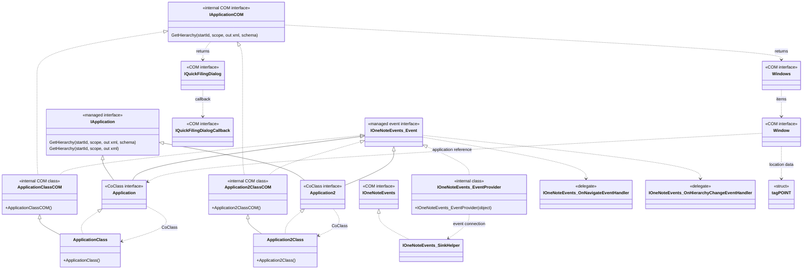

# Microsoft OneNote interop DLL architecture

This document describes Microsoft.Office.Interop.OneNote, version 15.0.0.0, as
inspected in the local development assembly. It covers all 34 declared types,
including non-public types. Method examples are not full member listings.

## Classes and interfaces

The diagram contains all 19 non-enum types. Solid triangles mean inheritance;
dashed triangles mean interface implementation. Dotted dependency edges
summarize usage, not ownership. External .NET types such as `System.__ComObject`
and runtime-added interfaces are excluded from the DLL type count.

`IApplicationCOM` describes the native application contract: 29 method entries,
including property accessors. `IApplication` exposes 53 entries, including 24
additional overloads. It does not inherit `IApplicationCOM`.

`Application` and `Application2` are interfaces despite their names. Their
`CoClass` attributes select `ApplicationClass` and `Application2Class`,
respectively. This lets C# expressions such as `new Application()` create the
associated class.

`ApplicationClassCOM` and `Application2ClassCOM` are COM-imported classes
handled by the .NET runtime. Their managed subclasses contain executable wrapper
code. This is inheritance from a COM-backed class, not composition with a
separate COM field in an ordinary managed object.

## Constructors

`ApplicationClass` and `Application2Class` each expose one public parameterless
constructor. The imported base classes also declare parameterless constructors,
but the classes themselves are non-public.

The internal event provider has a public constructor accepting `object`.
`IOneNoteEvents_SinkHelper` has no public constructor. Delegate constructors are
runtime delegate machinery, not application activation entry points.

## Enums and structure

```mermaid
classDiagram
    class CreateFileType {
        <<enum>>
    }
    class DockLocation {
        <<enum>>
    }
    class Error {
        <<enum>>
    }
    class FilingLocation {
        <<enum>>
    }
    class FilingLocationType {
        <<enum>>
    }
    class HierarchyElement {
        <<enum>>
    }
    class HierarchyScope {
        <<enum>>
    }
    class NewPageStyle {
        <<enum>>
    }
    class NotebookFilterOutType {
        <<enum>>
    }
    class PageInfo {
        <<enum>>
    }
    class PublishFormat {
        <<enum>>
    }
    class RecentResultType {
        <<enum>>
    }
    class SpecialLocation {
        <<enum>>
    }
    class TreeCollapsedStateType {
        <<enum>>
    }
    class XMLSchema {
        <<enum>>
    }
```

The complete inventory is 10 interfaces, six classes, two delegates, one
structure (`tagPOINT`), and 15 enums: 34 types total.

## Executable functionality

Besides GUIDs, COM signatures, marshaling metadata, enums, structures and
activation metadata, the assembly contains:

- Managed overloads that supply default arguments before forwarding calls.
- `AutoBusyRetry` helpers used by selected operations, including creation,
  updates, closing, and navigation. Their bodies contain exception handlers.
- Event interfaces, delegates, provider and sink code for event connection.

For example, `ApplicationClass.GetHierarchy(startId, scope, out xml)` supplies
the schema constant `2` and forwards to the full four-argument COM signature.
That value denotes the OneNote 2013 schema. It is executable wrapper logic, not
an optional-parameter attribute in the imported `IApplicationCOM` method. Some
other overloads supply defaults to a busy-retry helper rather than directly to
the imported method.

The DLL therefore has a managed convenience and interop role, including
forwarding behavior. The native OneNote application implements the underlying
notebook operations; it is not implemented in this assembly.
